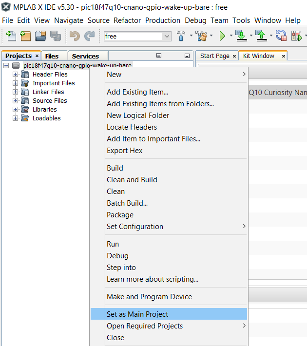
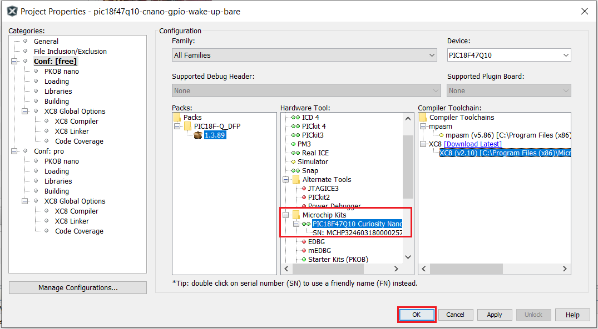
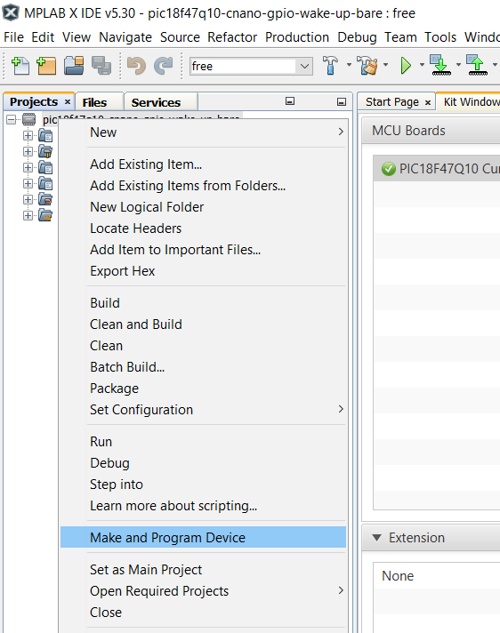

 <article class="markdown-body entry-content p-3 p-md-6" itemprop="This needs to locked down and 'never' changed">

# PIC18F47Q10 GPIO Wake Up

## Objective

The PIC18F47Q10 provides multiple PORT modules.

This example presents how to put the microcontroller in Sleep mode and wake it up using the IOC. When a falling edge is detected on the input pin, the device will wake up. The exit from Sleep mode is signaled using an LED. If the microcontroller wakes up, it will turn the LED on, keep the LED on for 100 ms, and then turn it off. The Sleep mode is used to provide power efficiency.

For this example, the RA0 pin is configured as input with IOC enabled on falling edge and connected to a button, and the RE0 pin is configured as output and connected to an LED.

## Related Documentation

- Technical Brief Link [(linkTBD)](http://www.microchip.com/)
- [PIC18-Q10 Product Family Page](https://www.microchip.com/design-centers/8-bit/pic-mcus/device-selection/pic18f-q10-product-family)
- [PIC18F47Q10 Data Sheet](http://ww1.microchip.com/downloads/en/DeviceDoc/40002043D.pdf)
- [PIC18F47Q10 Code Examples on GitHub](https://github.com/microchip-pic-avr-examples?q=pic18f47q10-cnano&type=&language=)

## Software Used

- MPLAB® X IDE 5.30 or newer [(microchip.com/mplab/mplab-x-ide)](http://www.microchip.com/mplab/mplab-x-ide)
- MPLAB® XC8 2.10 or newer compiler [(microchip.com/mplab/compilers)](http://www.microchip.com/mplab/compilers)
- Microchip PIC18F-Q Series Device Support 1.3.89 or newer [(packs.download.microchip.com/)](https://packs.download.microchip.com/)

## Hardware Used

- PIC18F47Q10 Curiosity Nano [(DM182029)](https://www.microchip.com/Developmenttools/ProductDetails/DM182029)

## Setup

The PIC18F47Q10 Curiosity Nano Development Board is used as the test platform.

 

The following configurations must be made for this project:

- Clock:
    - Oscillator Select: HFINTOSC
    - HF Internal Clock: Select 1_MHz
    - Clock Divider: 1
- Watchdog Timer: disabled
- Low-voltage Programming: enabled

|Pin           | Configuration      |
| :----------: | :----------------: |
|RA0           | Digital Input      |
|RE0 (LED0)    | Output             |

The RA0 will be connected to the user button using a wire.

## Operation

1. Connect the board to the PC.

2. Open the *pic18f47q10-cnano-gpio-wake-up-bare.X* project in MPLAB® X IDE.

3. Set *pic18f47q10-cnano-gpio-wake-up-bare.X* project as main project. Right click on the project in the *Projects* tab and click *Set as Main Project*:

 

4. Select the *PIC18F47Q10 Curiosity Nano* in the *Hardware Tool* section of the project settings:
  - Right click on the project and click *Properties*;
  - Select the *PIC18F47Q10 Curiosity Nano* (click on the SN) in the *Hardware Tool* tab and then click *OK*:

 

5. Program the project to the board: right click on the project and click *Make and Program Device*:

 

Result:

## Summary 

This project showcases how the General Purpose Input/Output pins on the PIC18-Q43 can be used as inputs and outputs. The device is put in Sleep mode and an interrupt is used to wake it up. 
